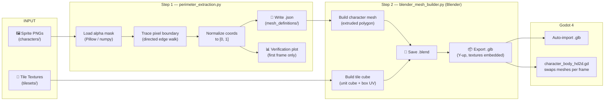

# 🎮 HD-2D Sprite Mesh Pipeline

> **Pixel-perfect 3D meshes from 2D sprite sheets — for HD-2D games built in Godot 4.**

This toolkit converts pixel-art sprite PNGs into fully textured Blender meshes and exports
them as `.glb` files ready to drop into Godot 4.  It powers a classic HD-2D effect: a
2D character silhouette rendered in 3D space with proper depth, lighting, and shadows.

Two pipelines run end-to-end from a single Blender command:

| Pipeline | Input | Output | Purpose |
|---|---|---|---|
| **Character** | `characters/character_N/…_frames/` PNGs | Per-frame `.glb` mesh | Animated sprite silhouettes |
| **Tileset** | `tilesets/tileset_N/` face PNGs | Per-tileset `.glb` cube | Textured world tiles |


---

## 📋 Table of Contents

- [Pipeline Overview](#-pipeline-overview)
- [Directory Structure](#-directory-structure)
- [Prerequisites & Installation](#-prerequisites--installation)
- [Usage](#-usage)
  - [Running the Full Pipeline](#running-the-full-pipeline)
  - [Running Perimeter Extraction Alone](#running-perimeter-extraction-alone)
  - [Fixing Godot Texture Imports](#fixing-godot-texture-imports)
- [Configuration Reference](#-configuration-reference)
- [Input & Output Formats](#-input--output-formats)
  - [Sprite Frame Naming Convention](#sprite-frame-naming-convention)
  - [JSON Contour Schema](#json-contour-schema)
  - [Tileset Texture Naming](#tileset-texture-naming)
- [Coordinate System & UV Notes](#-coordinate-system--uv-notes)
- [Troubleshooting](#-troubleshooting)
- [Contributing](#-contributing)
- [License](#-license)

---

## 🗺 Pipeline Overview



---

## 📁 Directory Structure

```
perimeter_calculation/
│
├── 📄 perimeter_extraction.py      # Step 1 — traces PNG silhouettes → JSON
├── 📄 blender_mesh_builder.py      # Step 2 — builds .blend files and exports .glb
├── 📄 fix_godot_texture_imports.py # Utility — patches Godot .import files after reimport
├── 📄 character_body_hd2d.gd       # Godot script — runtime mesh swapping
├── 📄 character_meshes_workspace.blend  # Blender project workspace
│
├── characters/
│   └── character_1/
│       ├── idle_frames/
│       │   └── directions/
│       │       ├── south/        south.png
│       │       ├── north/        north.png
│       │       ├── east/         east.png
│       │       ├── west/         west.png
│       │       ├── north_east/   north_east.png
│       │       ├── north_west/   north_west.png
│       │       ├── south_east/   south_east.png
│       │       └── south_west/   south_west.png
│       ├── run_frames/
│       │   └── directions/
│       │       ├── south/        south1.png  south2.png  …
│       │       ├── north/        north1.png  north2.png  …
│       │       └── …             (8 directions × N frames)
│       ├── mesh_definitions/     ← generated by perimeter_extraction.py
│       │   ├── idle_mesh/
│       │   │   └── directions/
│       │   │       └── south/    south0.json  verification_south0.png
│       │   └── run_mesh/
│       │       └── directions/
│       │           └── south/    south1.json  south2.json  …
│       ├── blend_files/          ← generated by blender_mesh_builder.py
│       │   ├── idle_mesh/directions/south/  south0.blend
│       │   └── run_mesh/ directions/south/  south1.blend  south2.blend  …
│       └── glb_files/            ← generated by blender_mesh_builder.py
│           ├── idle_mesh/directions/south/  south0.glb
│           └── run_mesh/directions/south/   south1.glb  south2.glb  …
│
└── tilesets/
    └── tileset_1/
        ├── top.png               # Face textures (any may be omitted → gray fallback)
        ├── bottom.png
        ├── front.png
        ├── back.png
        ├── right.png
        ├── left.png
        ├── blend_files/tile_mesh/  tileset_1.blend   ← generated
        └── glb_files/tile_mesh/    tileset_1.glb     ← generated
```

---

## ⚙️ Prerequisites & Installation

### System Requirements

| Requirement | Version | Notes |
|---|---|---|
| Python | 3.11+ | System Python (not Blender's bundled Python) |
| Blender | 5.1+ | Must be on system `PATH` |
| Godot | 4.x | For consuming the exported `.glb` files |

### Python Dependencies

Install once into your **system** Python (not Blender's Python):

```bash
python -m pip install Pillow numpy matplotlib
```

> **Why system Python?**  `blender_mesh_builder.py` runs inside Blender's Python
> environment, which does not have Pillow/numpy/matplotlib.  It detects your system
> Python automatically and calls `perimeter_extraction.py` as a subprocess.
> The fallback search order is: `sys.executable` → `python` → `python3` → `py`.

### Verifying Blender is on PATH

```bash
blender --version
```

If the command is not found, add Blender's installation directory to your system `PATH`
and restart your terminal.

---

## 🚀 Usage

### Running the Full Pipeline

Run from the `perimeter_calculation/` directory:

```bash
blender --background --python blender_mesh_builder.py
```

This single command:
1. Calls `perimeter_extraction.py` via system Python to regenerate all JSON contour files.
2. Reads every JSON file under `characters/` and builds a textured Blender mesh for each frame.
3. Saves each mesh as a `.blend` file and exports it as a `.glb`.
4. Discovers every `tileset_N/` directory under `tilesets/`, builds a textured unit cube for each, and exports those as `.glb` files too.

**Expected terminal output:**

```
Running perimeter extraction: …/perimeter_extraction.py
  Trying interpreter: python
Run complete. 87 frames processed, 0 skipped.

Found 1 tileset(s) under …/tilesets

Built:    characters/character_1/…/south1.json -> …/south1.blend
Exported: characters/character_1/…/south1.json -> …/south1.glb
…
Built:    tilesets/tileset_1 -> tilesets/tileset_1/blend_files/tile_mesh/tileset_1.blend
Exported: tilesets/tileset_1 -> tilesets/tileset_1/glb_files/tile_mesh/tileset_1.glb

Build complete. 87 character mesh(es) built, 0 failed.
87 character GLB(s) exported, 0 failed. 1 tile mesh(es) built, 0 failed.
```

---

### Running Perimeter Extraction Alone

If you only want to regenerate the JSON contour files without rebuilding meshes:

```bash
# Run from the perimeter_calculation/ directory
python perimeter_extraction.py
```

A **verification plot** (side-by-side source image + traced contour) is saved for the
very first processed frame.  Review it to confirm the silhouette is correct before
triggering the full Blender build.

<details>
<summary>📷 What the verification plot shows</summary>

The plot has two panels:

- **Left** — the original RGBA sprite frame at native resolution
- **Right** — the normalized stair-step contour in UV space (0–1), with vertex indices
  annotated every N vertices

The contour is plotted in **image space** (Y increases downward), which is how it is
stored in the JSON.  The Y-flip to Blender/Godot space is applied later in
`blender_mesh_builder.py`.

The verification plot is saved to:
```
characters/{character_N}/mesh_definitions/{animation}_mesh/directions/{dir}/
    verification_{dir}{frame_index}.png
```

</details>

---

### Fixing Godot Texture Imports

Every time you drag new `.glb` files into the Godot editor, Godot regenerates the
`.import` sidecar files and resets texture compression to **VRAM Compressed (S3TC)**
— a lossy 4×4 block format that destroys pixel art colours.

Run this script once after each reimport:

```bash
python fix_godot_texture_imports.py
```

It patches every `*.png.import` file under the configured Godot asset directory to use
**Lossless** compression and disables mipmaps.

> Edit `GLB_ROOT` at the top of the script to point to your Godot project's asset
> directory if it differs from the default.

<details>
<summary>What the script actually patches</summary>

For each `.png.import` file found:

| Setting | Before | After | Reason |
|---|---|---|---|
| `compress/mode` | `2` (S3TC) | `0` (Lossless) | Prevents colour shift on pixel art |
| `mipmaps/generate` | `true` | `false` | Mipmaps blur pixel art at a distance |
| `compress/high_quality` | any | `false` | Irrelevant for lossless; keeps files tidy |

</details>

---

## 🔧 Configuration Reference

### `perimeter_extraction.py`

| Constant | Default | Description |
|---|---|---|
| `CHARACTERS_ROOT` | `"characters"` | Root folder for all character data, relative to the script. |
| `CANVAS_WIDTH` | `32` | **Documentation only.** Reference canvas width in pixels. Normalization uses each image's actual dimensions. |
| `CANVAS_HEIGHT` | `32` | **Documentation only.** Reference canvas height in pixels. Normalization uses each image's actual dimensions. |
| `ALPHA_THRESHOLD` | `0` | Pixels with alpha **strictly above** this value are treated as opaque. `0` means any non-zero alpha counts. |
| `USE_LARGEST_CONTOUR_ONLY` | `True` | When `True`, only the longest boundary loop is kept. Set to `False` (and update the JSON schema + Blender script) to support disconnected silhouettes. |

### `blender_mesh_builder.py`

| Constant | Default | Description |
|---|---|---|
| `PERIMETER_SCRIPT` | `"perimeter_extraction.py"` | Filename of the extraction script, relative to `blender_mesh_builder.py`. |
| `CHARACTERS_DIR` | `"characters"` | Root folder for character data, relative to the script. |
| `THICKNESS_DIVISOR` | `128` | Controls extrusion depth: `thickness = 1.0 / THICKNESS_DIVISOR`. Larger values = thinner mesh. |
| `TILESETS_DIR` | `"tilesets"` | Root folder for tileset data, relative to the script. |

### `fix_godot_texture_imports.py`

| Constant | Default | Description |
|---|---|---|
| `GLB_ROOT` | *(hardcoded path)* | Absolute path to the Godot project's asset directory containing the `.png.import` files. Edit to match your project location. |

---

## 📐 Input & Output Formats

### Sprite Frame Naming Convention

Frames must live inside a `directions/` sub-tree within an `{animation}_frames/` folder:

```
characters/
  character_{N}/
    {animation}_frames/
      directions/
        {direction}/
          {direction}.png          → frame_index 0  (single-frame animation)
          {direction}1.png         → frame_index 1
          {direction}2.png         → frame_index 2
          …
```

**Rules:**

- `{animation}` is derived from the folder name by stripping `_frames`
  (e.g. `run_frames` → animation `"run"`).
- `{direction}` can be any string matching a folder name: `south`, `north_east`, etc.
- Frames are sorted by their numeric suffix. Missing numbers are allowed.
- A fully transparent frame (all pixels `alpha ≤ ALPHA_THRESHOLD`) is silently skipped
  with a warning printed to stdout.

### JSON Contour Schema

Each processed frame produces one JSON file in `mesh_definitions/`:

```jsonc
{
  "character":   "character_1",          // string — matches the character_N folder name
  "animation":   "run",                  // string — derived from the *_frames folder
  "direction":   "north",                // string — direction folder name
  "frame_index": 1,                      // integer — numeric suffix from filename (0 if none)
  "canvas_size": [32, 32],               // [width, height] in pixels — ACTUAL image dimensions
  "source_image": "characters/character_1/run_frames/directions/north/north1.png",
                                         // string — path relative to perimeter_calculation/
  "contour": [
    [0.40625, 0.03125],                  // [x_norm, y_norm] — both in [0.0, 1.0]
    [0.43750, 0.03125],
    // … ordered list of pixel-grid corner vertices, clockwise winding (image space)
  ]
}
```

<details>
<summary>📌 Coordinate conventions</summary>

- `x_norm = col / image_width` — increases left → right
- `y_norm = row / image_height` — increases top → bottom (**image space, Y-down**)
- Values are rounded to 8 decimal places
- The contour is a **closed polygon** — the last vertex implicitly connects back to the first
- Every vertex lies on a pixel-grid **corner** (not pixel centre), so the polygon follows
  pixel edges exactly with no sub-pixel interpolation

The Y-flip (`1.0 - y_norm`) to convert image-space to Blender-space Y-up is applied in
`blender_mesh_builder.py`, not here.

</details>

### Tileset Texture Naming

Place face textures directly inside the `tileset_{N}/` directory:

| Filename | Cube Face | Blender Normal |
|---|---|---|
| `top.png` | Top face | +Y |
| `bottom.png` | Bottom face | −Y |
| `front.png` | Front face | +Z |
| `back.png` | Back face | −Z |
| `right.png` | Right face | +X |
| `left.png` | Left face | −X |

Any missing face texture is replaced by a **mid-gray fallback material** and a
warning is printed.  The export continues.

**Recommended texture size:** match your character sprite canvas (e.g. 32×32 px) for
visual consistency.

---

## 🧭 Coordinate System & UV Notes

<details>
<summary>How coordinates flow from PNG to Godot (important for debugging)</summary>

### Character Mesh

| Stage | Convention | Notes |
|---|---|---|
| `perimeter_extraction.py` | Image space (Y-down) | `x_norm = col/W`, `y_norm = row/H` |
| `blender_mesh_builder.py` vertex | Blender space (Y-up) | `vert.y = 1.0 − y_norm` |
| UV assignment | `uv = (vert.x, vert.y)` | V in Blender = `1 − y_norm` |
| glTF V-flip (Blender export) | `v_glTF = 1 − v_blender` | Net: `v_godot = y_norm` ✓ |
| 90° X rotation (baked) | Maps Blender +Y → world +Z | Character stands upright |
| `export_yup=True` | Blender +Z → Godot +Y | Standard glTF Y-up |

### Tile Cube

| Face | U formula | V formula (Blender) | V in Godot (after glTF flip) |
|---|---|---|---|
| top (+Y) | `x + 0.5` | `−z + 0.5` | `z + 0.5` |
| bottom (−Y) | `x + 0.5` | `z + 0.5` | `−z + 0.5` |
| front (+Z) | `x + 0.5` | `y + 0.5` | `0.5 − y` |
| back (−Z) | `−x + 0.5` | `y + 0.5` | `0.5 − y` |
| right (+X) | `−z + 0.5` | `y + 0.5` | `0.5 − y` |
| left (−X) | `z + 0.5` | `y + 0.5` | `0.5 − y` |

All vertex coordinates `x, y, z` are in Blender **local** space before the 90° X
rotation is applied (`±0.5` for a unit cube centred at origin).

</details>

---

## 🛠 Troubleshooting

<details>
<summary>⚠️ Texture colours look washed out / wrong after importing into Godot</summary>

**Cause:** Godot regenerated the `.png.import` files and defaulted to S3TC block
compression, which destroys pixel art.

**Fix:** Run `fix_godot_texture_imports.py` after every reimport:
```bash
python fix_godot_texture_imports.py
```

This patches every `.import` file to use Lossless compression and disables mipmaps.
You do **not** need to rebuild the GLBs — just switch back to the Godot editor and let
it recompile.

</details>

<details>
<summary>⚠️ Texture appears offset from the character silhouette</summary>

**Cause:** The sprite frame's actual pixel dimensions differ from the reference canvas
size (`CANVAS_WIDTH` / `CANVAS_HEIGHT`).  If a frame is, say, 40×40 px but the
reference is 32×32, the normalised contour contains `y_norm > 1.0` values, which
produce out-of-bounds UV coordinates in the exported GLB.

**Symptoms:** A `WARNING: Canvas size mismatch` line in the console for that frame.

**Fix:** Resize the sprite to match the reference canvas.  The reference canvas size
is documented in `CANVAS_WIDTH` / `CANVAS_HEIGHT` at the top of
`perimeter_extraction.py`.  All frames for all animations of a character **must** share
the same canvas size.

After resizing, re-run the full pipeline so the JSON files are regenerated from the
corrected images.

</details>

<details>
<summary>⚠️ perimeter_extraction.py fails with "No module named 'matplotlib'"</summary>

**Cause:** Pillow, numpy, and/or matplotlib are not installed in the Python interpreter
being used.

**Fix:**
```bash
python -m pip install Pillow numpy matplotlib
```

Make sure you are running this with the **system** Python (not a virtual environment
that Blender cannot find, and not Blender's own Python).

Verify which interpreter will be used:
```bash
python --version
python -c "import matplotlib; print('OK')"
```

</details>

<details>
<summary>⚠️ blender_mesh_builder.py says "perimeter_extraction.py failed on all available interpreters"</summary>

The script tries four interpreter candidates in order:

1. `sys.executable` (Blender's bundled Python — usually fails, lacks packages)
2. `python` (system PATH)
3. `python3` (system PATH, common on macOS/Linux)
4. `py` (Windows Python Launcher)

**Fix options:**

- Install the packages in whichever interpreter resolves on your PATH:
  `python -m pip install Pillow numpy matplotlib`
- If the script still fails, run `perimeter_extraction.py` manually first
  (`python perimeter_extraction.py`) so the JSON files exist, then re-run
  `blender_mesh_builder.py` — it will use the existing JSONs and print a warning.

</details>

<details>
<summary>⚠️ "No contour found" for a specific frame</summary>

**Cause:** The frame PNG is either fully transparent, or `ALPHA_THRESHOLD` is set too
high and all pixels are being treated as transparent.

**Fix:**
1. Open the PNG and confirm it has opaque pixels.
2. If the sprite uses very low alpha values (e.g. semi-transparent edges), lower
   `ALPHA_THRESHOLD` to `0` in `perimeter_extraction.py` (this is already the default).

</details>

<details>
<summary>⚠️ Blender reports "AttributeError: 'Material' has no attribute 'shadow_method'"</summary>

**Cause:** Blender 4.x removed `shadow_method` from materials.  In Blender 5.x the
API uses `use_transparent_shadow` instead.

**Fix:** `blender_mesh_builder.py` already uses `use_transparent_shadow = True` and
`blend_method = "CLIP"`, which is the correct API for Blender 5.x.  If you are on an
older version, open the script and replace those two lines with:
```python
mat.shadow_method = 'CLIP'
```

</details>

<details>
<summary>⚠️ GLB export fails with "TypeError: export_image_format"</summary>

**Cause:** The `export_image_format` parameter name changed between Blender versions.

**Fix:** This is already handled for the tile pipeline.  If you see it for the
character pipeline (`export_glb`), change `export_image_format='AUTO'` to
`export_image_format='JPEG'` or remove the argument entirely to use the default.

</details>

<details>
<summary>⚠️ Tiles appear to face the wrong direction in Godot</summary>

**Cause:** Blender's coordinate system (Z-up) is converted to Godot's Y-up via
`export_yup=True`, and a 90° X-axis rotation is baked into the tile geometry before
export.  If you expect a different orientation, you can either:

1. Rotate the tile node in Godot's scene editor.
2. Remove the `obj.rotation_euler.x = math.radians(90)` line and the
   `transform_apply` call in `process_tilesets()` in `blender_mesh_builder.py`.

</details>

---

## 🤝 Contributing

Contributions are welcome!  Here are the main extension points identified in the code:

### Adding a New Character

1. Create `characters/character_N/` with the same sub-folder structure as `character_1`.
2. Add sprite PNGs.  All frames **must** share the same canvas size.
3. Re-run the pipeline.

### Adding a New Animation

1. Create `{animation}_frames/directions/` inside your character folder.
2. Add PNGs following the naming convention.
3. Re-run the pipeline.

### Supporting Disconnected Silhouettes

Characters with visually separate body parts (e.g. a held weapon floating apart from
the body) require multi-contour support.  The code already has an extension point:

```python
# perimeter_extraction.py
USE_LARGEST_CONTOUR_ONLY = False   # set this flag
# Then update:
# - extract_pixel_boundary() to return a list of contours
# - write_json() to store a list of lists under "contour"
# - build_mesh_from_json() to create one face per contour and combine them
```

### Code Style

- Follow the existing docstring style (Google-style Args/Returns blocks).
- Keep the `# CONFIGURATION` block at the top of each script as the single place to
  tune behaviour.
- All file paths in JSON and print output use forward slashes (`.as_posix()` or
  `to_forward_slashes()`).

---

## 📄 License

MIT License

Copyright (c) 2025 Jonathan Whitehead

Permission is hereby granted, free of charge, to any person obtaining a copy
of this software and associated documentation files (the "Software"), to deal
in the Software without restriction, including without limitation the rights
to use, copy, modify, merge, publish, distribute, sublicense, and/or sell
copies of the Software, and to permit persons to whom the Software is
furnished to do so, subject to the following conditions:

The above copyright notice and this permission notice shall be included in all
copies or substantial portions of the Software.

THE SOFTWARE IS PROVIDED "AS IS", WITHOUT WARRANTY OF ANY KIND, EXPRESS OR
IMPLIED, INCLUDING BUT NOT LIMITED TO THE WARRANTIES OF MERCHANTABILITY,
FITNESS FOR A PARTICULAR PURPOSE AND NONINFRINGEMENT. IN NO EVENT SHALL THE
AUTHORS OR COPYRIGHT HOLDERS BE LIABLE FOR ANY CLAIM, DAMAGES OR OTHER
LIABILITY, WHETHER IN AN ACTION OF CONTRACT, TORT OR OTHERWISE, ARISING FROM,
OUT OF OR IN CONNECTION WITH THE SOFTWARE OR THE USE OR OTHER DEALINGS IN THE
SOFTWARE.
